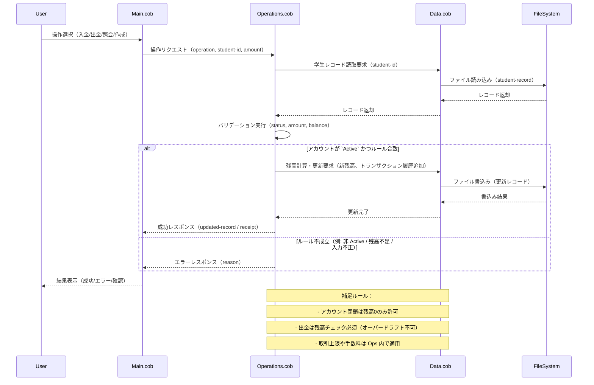

リポジトリ内の COBOL ファイル説明
===============================

このドキュメントは、`src/cobol` 配下にある主要な COBOL ファイルの目的、主要な機能、そして学生アカウントに関連する業務ルールをまとめたものです。

**Data.cob**
- **目的:** 学生アカウントのレコード定義とファイル入出力（ファイル定義、レコードレイアウト、固定長/可変長レコードの扱い）を担います。
- **主要な機能:**
  - データ定義（Student レコード、フィールド定義）
  - 物理ファイル（帳票/データファイル）との入出力処理
  - レコード単位の読み書き、検索、シーケンシャル更新のサポート
  - 基本的な入力バリデーション（ID 形式、数値フィールドの整合性）
- **学生アカウントに関する業務ルール:**
  - 学生ID は一意で所定の形式（例: 8 桁の数字）であること。
  - アカウントには `status`（Active/Inactive/Dormant 等）フィールドが含まれる。
  - 初期残高は明示的に設定しない場合は `0` とする。
  - 金額フィールドは小数点以下桁数や通貨単位の規則に従う。

**Main.cob**
- **目的:** プログラムのエントリポイントであり、メニュー制御や処理フロー（アプリケーションの主ループ）を実装します。
- **主要な機能:**
  - ユーザー（オペレータ）向けの簡易メニュー表示と操作ハンドリング
  - `data.cob` / `operations.cob` のサブルーチン呼び出し（作成・更新・照会など）
  - エラー処理と基本的なログ出力（トランザクションの成功/失敗の記録）
- **学生アカウントに関する業務ルール:**
  - 取引（入金・出金・残高照会）は `status` が `Active` のアカウントに対してのみ実行可能。
  - 入力金額は正の数であることを要求する（0 未満は許容しない）。
  - 出金は残高が十分にある場合にのみ許可する（オーバードラフト不可）。
  - アカウント作成時には必須フィールド（学生ID、氏名、登録日など）の入力を検証する。

**Operations.cob**
- **目的:** 実際のビジネスロジック（アカウント操作）の実装を担当します。メニューから呼び出される各操作の詳細を定義します。
- **主要な機能:**
  - アカウント作成・更新・削除サブルーチン
  - 入金・出金・残高照会・トランザクション記録
  - バリデーションとトランザクション一貫性の確保（レコードの読み取り→検証→更新の順）
  - 必要に応じた計算（利息計算、手数料計算）や状態遷移処理
- **学生アカウントに関する業務ルール:**
  - アカウント閉鎖は残高が `0` の場合のみ許可する。
  - 出金時は即時に残高をチェックし、残高不足なら処理を拒否する（オーバードラフト不可）。
  - 一日の出金上限や個別トランザクション上限がある場合、そのルールを適用するフックを用意する（現在の実装では定数で管理されている可能性あり）。
  - 長期間取引のないアカウントは `Dormant` としてフラグを立て、追加の権限チェックや手数料適用の対象とする場合がある。
  - 奨学金や学費控除など外部プロセスと連携するフラグ（例: `scholarship-flag`）がある場合、該当フラグに基づく自動処理を想定している。

補足
- テスト用データやサンプルレコードは `src/cobol/data.cob` 内に存在することが多いため、初期動作確認はそこを参照してください。
- COBOL の古いスタイル（固定長レコード、直接ファイル更新など）が使われている可能性があり、マイグレーション時はトランザクションの原子性とデータ整合性に注意してください。

もし、各ルーチンのより詳細なシーケンス図やフィールド定義表が必要であれば、続けて作成します。

以下はアプリケーションのデータフローを示す Mermaid シーケンス図です（`src/cobol` 内の `Main.cob` → `Operations.cob` → `Data.cob` の流れを表現）。README に貼り付けてそのままレンダリングできます。

